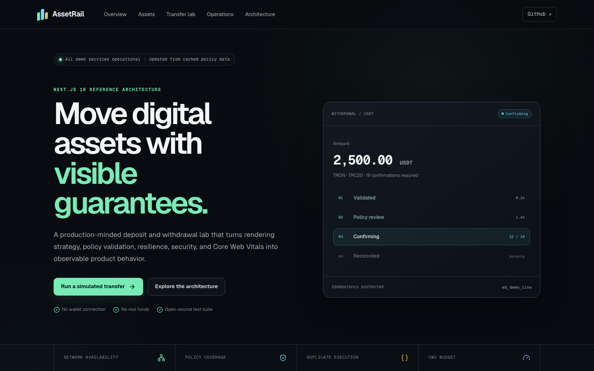
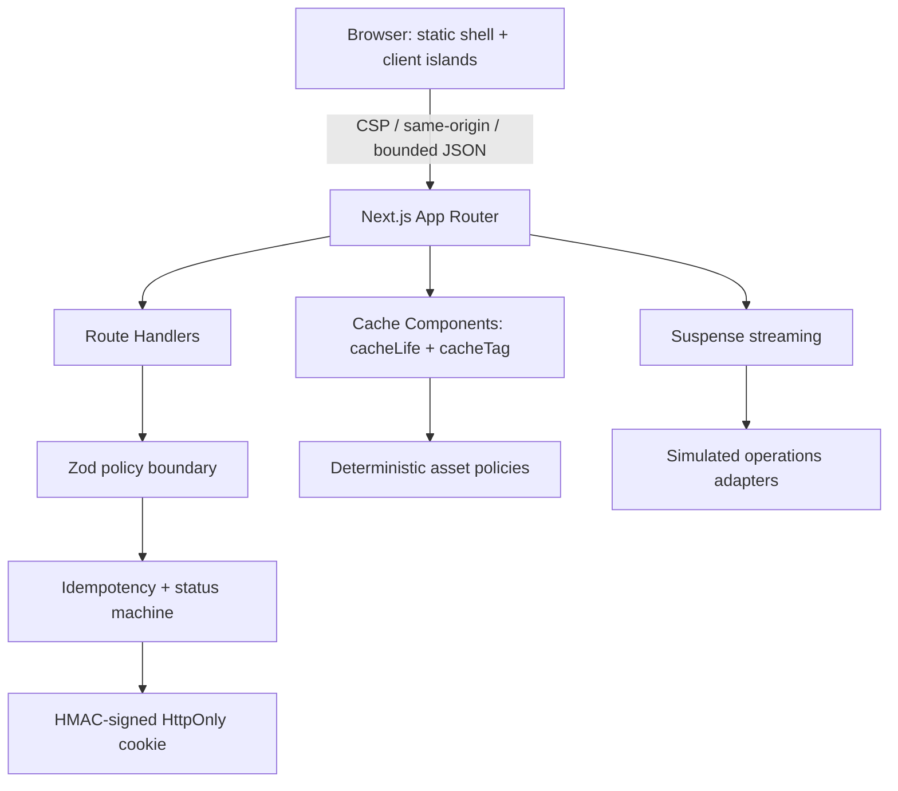

# AssetRail

**A deposit and withdrawal reliability lab built with Next.js 16.**

[Live demo](https://assetrail.vercel.app) · [Architecture](./docs/ARCHITECTURE.md) · [Threat model](./docs/THREAT_MODEL.md) · [Test plan](./docs/TEST_PLAN.md)

[](https://github.com/thunderxu7-sketch/assetrail/actions/workflows/quality.yml)
[](./LICENSE)

AssetRail is a production-minded reference implementation for a high-risk exchange workflow. It does **not** connect a wallet, store private keys, move funds, or fabricate on-chain transactions. It makes engineering decisions visible: rendering modes, cache freshness, policy validation, idempotency, progressive reconciliation, degraded states, security boundaries, Web Vitals, and automated quality gates.



## Why this project exists

Deposit and withdrawal interfaces look like forms, but the real product is a distributed state machine across policy services, risk controls, signing, chain gateways, confirmations, and ledgers. AssetRail demonstrates how a senior frontend engineer can:

- design a route-specific **SSG / ISR / SSR / streaming** architecture instead of applying one rendering mode everywhere;
- encode network policy as a shared domain contract rather than duplicating rules across UI and API code;
- treat maintenance, congestion, memo/tag requirements, duplicate requests, high-risk holds, and delayed confirmations as product states;
- introduce AI-assisted delivery without delegating acceptance to a model;
- manage Core Web Vitals with budgets, field telemetry, stable geometry, and bundle inspection;
- provide full-stack ownership through secure Route Handlers, server cache controls, CI, and deployment.

## Product surface

| Route | User capability | Rendering decision | Freshness |
| --- | --- | --- | --- |
| `/` | Understand system guarantees | Static + cached server data | tagged catalog |
| `/assets` | Compare asset/network rules | SSG / Cache Components | explicit revalidation |
| `/assets/[symbol]` | Inspect rail policy | ISR + partial prerendering | 15 minutes + asset tag |
| `/transfer` | Validate a simulated request | server shell + client island | live interaction |
| `/transfers/[id]` | Track private progress | SSR + client reconciliation | `private, no-store` |
| `/ops` | Observe rail/risk/reconciliation state | Suspense streaming | request time |
| `/performance` | Inspect browser Web Vitals | client telemetry island | local session |
| `/architecture` | Review trade-offs | static documentation | build time |

## Architecture



The demo intentionally uses deterministic fixtures and a signed cookie instead of pretending to be a real custody backend. In production, the domain interface would be backed by authenticated policy, ledger, risk, signing, gateway, and reconciliation services. See [the architecture record](./docs/ARCHITECTURE.md) for the replacement seams and trade-offs.

## Engineering highlights

### Rendering and cache control

- Next.js 16 Cache Components with `"use cache"`, `cacheLife`, and scoped `cacheTag` values.
- Popular asset routes are generated ahead of demand; the same dynamic segment supports runtime generation.
- Request-bound transfer state is isolated behind Suspense instead of making the whole application dynamic.
- Operational panels stream independently so a slow dependency does not delay the full control surface.
- A token-protected, allowlisted revalidation endpoint prevents arbitrary cache eviction.

### Reliability and security

- Shared Zod contract validates asset support, rail availability, minimum amount, address family, and destination memo/tag.
- Same-origin mutation check, JSON content-type and body-size limits, idempotency header, and replay handling.
- HMAC-signed, `HttpOnly`, `SameSite=Strict`, secure-in-production demo state.
- Security headers include CSP, frame denial, MIME sniffing protection, restrictive permissions, and referrer policy.
- Explicit state machine: `created → policy_review → broadcasting → confirming → completed`, with `held` and `failed` terminal branches.

### Performance and delivery

- LCP ≤ 2.5 s, INP ≤ 200 ms, and CLS ≤ 0.1 are release budgets—not hard-coded claims.
- Framework-native Web Vitals reporter stores a local field sample and validates the ingestion contract.
- Stable skeleton geometry, server-first rendering, restrained client boundaries, and built-in bundle analysis.
- CI gates: ESLint, TypeScript, unit tests, production build, Playwright, responsive checks, and axe WCAG scans.

## Local development

Requirements: Node.js 20+ and npm 10+.

```bash
git clone https://github.com/thunderxu7-sketch/assetrail.git
cd assetrail
cp .env.example .env.local
npm ci
npm run dev
```

Open [http://localhost:3000](http://localhost:3000).

Generate secure local secrets:

```bash
openssl rand -base64 32
```

## Quality commands

```bash
npm run lint          # zero-warning ESLint gate
npm run typecheck     # strict TypeScript validation
npm test              # domain and trust-boundary tests
npm run build         # production rendering verification
npm run test:e2e      # Chromium + mobile Playwright suite
npm run analyze:bundle
npm run check         # lint + types + unit + build
```

## Protected cache revalidation

Only known tags are accepted:

```bash
curl -X POST http://localhost:3000/api/cache/revalidate \
  -H "Authorization: Bearer $REVALIDATION_TOKEN" \
  -H "Content-Type: application/json" \
  -d '{"tag":"asset-policy:usdt"}'
```

## Repository guide

```text
src/app/                  routes, streaming boundaries, Route Handlers
src/components/           server-first UI and isolated client islands
src/lib/assets.ts         deterministic policy fixtures
src/lib/asset-data.ts     cache lifetime and invalidation contracts
src/lib/transfers.ts      validation, idempotency model, status machine
tests/e2e/                browser, responsive, and accessibility coverage
docs/                     ADRs, threat model, test plan, AI workflow, demo script
```

## Interview walkthrough

Start with the [five-minute demo script](./docs/DEMO_SCRIPT.md). The strongest discussion threads are:

1. why policy catalogs, transfer status, and operations panels need different rendering/freshness models;
2. how UI/API rule parity and idempotency reduce high-risk transfer failures;
3. why the demo refuses to imply real custody or on-chain execution;
4. how field Web Vitals and deterministic gates make performance and AI-assisted development operational;
5. which adapters would change for a real exchange while the domain contract and frontend state model remain stable.

## Disclaimer

All assets, prices, addresses, incidents, risk scores, times, and transfer records are deterministic demo data. AssetRail is not affiliated with any exchange or asset issuer and must not be used to move funds.

## License

[MIT](./LICENSE) © 2026 Gray Xu
